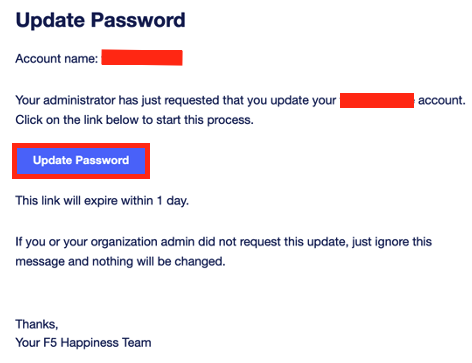
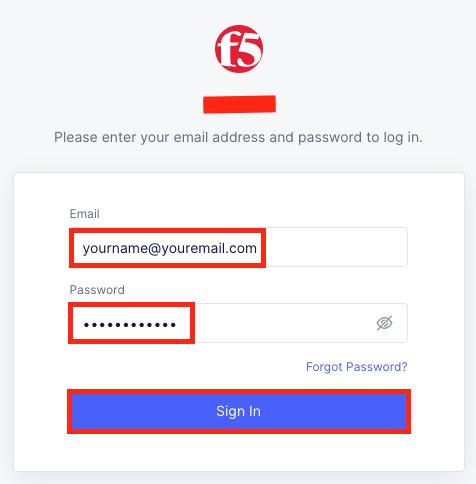
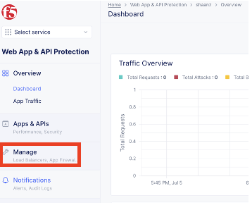
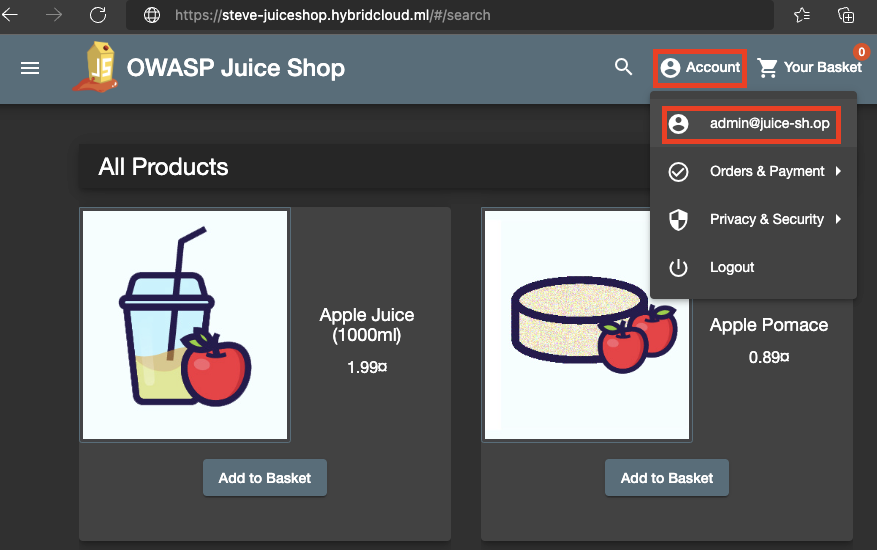

<h2>F5 Distributed Cloud WAAP Hands-On Lab</h2>

 
 
<h3>Table of Contents</h3>
PRE-REQUISITE 
SECTION 1: SETTING UP THE NEW ACCOUNT 
SECTION 2:  ONBOARDING A NEW APPLICATION 
SECTION 3:  ENABLE WAAP 
SECTION 4:  VISIBILITY/DAY2 OPERATIONS 
SECTION 5:  TURNING ON API DISCOVERY & SHADOW API 
ACKNOWLEDGEMENT 
 
<h4>PRE-REQUISITE</h4>
•	F5 Distributed Cloud credential 
•	Laptop/desktop browser with internet connectivity 
•	Target application: http://js.witcher.sg 
 
<h4>SECTION 1: SETTING UP THE NEW ACCOUNT</h4>
This section focusses on setting up your new account  
1.1)	Email with link to change password. Click “Update Password” 

 

1.2)	 Provide new credential and click “Submit” 
 

1.3)	Click “Log In” 
 

1.4)	Provide tenant name “f5-xctestdrive”. Click “Next” 
 

1.5)	Provide credential to login 
 

1.6)	Click “Check box” and “Accept and Agreement” 
 

1.7)	Click “Super User” and “Next” 
 

1.8)	Select Advance. Click “Get Started” 
 
 
<h4>SECTION 2:  ONBOARDING A NEW APPLICATION</h4>
This section focusses on onboarding an application and accessing it via F5 XC   
2.1)	On the home page click “Web App & API protection”, from Common Services 

  

2.2)	Click “Manage” on the Menu on left hand side 
  

2.3)	Click “Load Balancers” and the click “HTTP Load Balancers” 
  
 
2.4)	Click “Add HTTP Load Balancer” 
 

2.5)	Provide the following Metadata details 
Name: yourname-juiceshop [e.g., steve-juiceshop as shown in screenshot] 
Domain and LB Type: yourname-juiceshop.hybridcloud.ml [e.g., steve-juiceshop.hybridcloud.ml] 
 

2.6)	Load Balancer Type: “HTTPS with Custom Certificate” 
HTTP Redirect to HTTPS: 
HTTPS Port: 443 
Click "Configure" under TLS Parameters 
 
 
2.7)	Under TLS Certificates, click “Add Item” 
 
 
2.8)	Under Certificate URL, select “PEM” and paste full chain certificate public key value provided as part of the lab guide file (obtain public key from Lab Assistant) 
Under Private Key, click “Configure” 
 

2.9) Under Secret Info, click “Blindfold Secret” 
Under Text, paste private key value provided as part of the lab guide file (obtain public key from Lab Assistant) 
Click “Blindfold” 
Click “Apply" 
 

2.10) Click "Apply" at end of the page 
 

2.11) Under TLS Certificates, click "Apply" 
 

2.12) Under Origin Pools, click "Add Item" 
 

2.13) Click "Create new Origin Pool" or "Add Item" in Origin Pool 
 

2.14)	Provide Metadata for new origin pool 
Name: yourname-juiceshop-orig, e.g., steve-juiceshop-orig 
 
 
2.15)	Click “Add Item” under Origin Servers 
 

2.16)	Select Type of Origin Server: “Public DNS Name of Origin Server” 
DNS Name: “js.witcher.sg” 
Click “Apply” 
 

2.17)	Enter Origin server Port value as “80”, and leave the rest default 
 

2.18)	Click “Continue” at the end of the page 
 

2.19)	Click “Add Item” or “Apply” 
 
 
2.20)	Keep the rest as default and click “Save and Exit” at the end of the page 
 
 
2.21)	System provisioned the load balancer with a valid custom wildcard SSL certificate. Inform Lab assistant to provision your CNAME and virtual host DNS info separately <b>BEFORE</b> proceeding to browse your domain e.g., steve-juiceshop.hybridcloud.ml 
 
 
2.22)	Application has been on boarded and can be browsed using the domain name with http to https redirection capable e.g., steve-juiceshop.hybridcloud.ml 
 
 
<h4>Section 3:  Enable WAAP</h4>
This section focusses on securing the application with WAAP  

3.1)	Test application for SQL injection vulnerability. Click “Account” and then “Login” 
 

3.2)	Key in random Email and Password and click “Log in”, for login testing purpose 

3.3)	Key in the following payload for Email “admin' or 1=1 --” and dummy Password. Click “Log in” 
 

3.4)	SQL injection succeeded and logged in as “admin” without any valid credential 
 

3.5)	Click “Logout”, Key in Email “' or email like "%bender%";--“ and dummy Password. Click “Log in”, check which account logged in without any valid credential? 
 

3.6)	To enable WAAP on the load balancer. Go to “Web Application and API Protection” -> Manage - > Load Balancers -> HTTP Load Balancer 
Click “…” under edited load balancer e.g., steve-juiceshop 
Click “Manage Configuration” 
 

3.7)	Click “Edit Configuration” 
 

3.8)	Click “Web Application Firewall” on the left menu 
 

3.9)	Click the drop down under Web Application Firewall. Select “Enable” 
 

3.10)	Click “Create new App Firewall” or “Add Item” 
 

3.11)	Provide metadata for new app firewall rule 
Name: yourname-blocking-waf [e.g., steve-blocking-waf] 
 

3.12)	Select Enforcement Mode as “Blocking” 
 

3.13)	Leave the rest as default and click “Continue” 
 

3.14)	Keep the rest as default and click “Save and Exit” at end of the page 
 

3.15)	Run the same test as step 1 and this time, it should be blocked 
 
 
<h4>Section 4:  Visibility/Day2 Operations</h4>
This section focusses on traffic and security insights  

4.1)	Log on to the XC platform and click on “Web App and API Protection” 
 

4.2)	Click on “Apps & API” on the left menu and click on “Performance” 
 

4.3)	The detail of traffic for all load balancers is available here. Click on the load balancer created in section 2 [E.g., steve-juiceshop] 
 

4.4)	Analyze the detail on application telemetry 
 

4.5)	Click on “Security” under Apps & APIs on the left side menu 
 

4.6)	Click on the load balancer created in section 2 [E.g., steve-juiceshop] 
 

4.7)	Analyze the security dashboard 
 
 
<h4>Section 5:  Turning on API Discovery & Shadow API</h4>
This section focusses on turning on API Discovery feature  

5.1)	Log on to the XC platform and click on “Web App and API Protection” 
 

5.2)	Click on Manage -> Load Balancers -> HTTP Load Balancers 
 

5.3)	For the load balancer created in section 2 e.g., steve-juiceshop, click the three dots to open menu and click “Manage Configuration” 
 

5.4)	Click “Edit Configuration” on the top right-hand corner 
 

5.5)	Click “API Protection” from the left menu 
 

5.6)	Enable “API Discovery” and “Enable Learning From Redirect Traffic“ 
 

5.7)	Keep rest as default and click “Save and Exit” at the end of the page 
 

5.8)	Navigate the application and generate traffic (you can also use an automated scanner like ZAP to Spider the application) 

5.9)	Click on “APPs & APIs” and then click on “Security” 
 

5.10)	Select the load balancer, edited in this exercise [E.g., steve-juiceshop] 
 

5.11)	Select “API Endpoints” on the top menu 
 

5.12)	Based on traffic, the discovered APIs will be displayed. 
This might take up to 2 hours to populate 
 

5.13)	Click on Manage -> Load Balancers -> HTTP Load Balancers 
 

5.14)	For the load balancer created in section 2 e.g., steve-juiceshop, click the three dots to open menu and click “Manage Configuration” 
 

5.15)	Click “Edit Configuration” on the top right-hand corner 
 

5.16)	Click “API Protection” from the left menu 
 

5.17)	Select “Enable” from API Definition, click “Add Item” from Enable 
 

5.18)	Enter Metadata “Name” as yourname-juiceshop-swagger e.g., steve-juiceshop-swagger, click “Upload Swagger file” from Swagger Specs 
 

5.19)	Enter Metadata “Name” as yourname-juiceshop-swagger-va e.g., steve-juiceshop-swagger-v1, click “Upload File” from Upload Swagger File 
 

5.20)	Select “F5_Lab_Guide_v1_juice-shop_rest-v1-swagger.json” file saved in your local drive and click “Open”, which provided as part of the Lab exercise file or can be viewed and copied [here](https://github.com/f5xc/waap/blob/main/F5_Lab_Guide_v1_juice-shop_rest-v1-swagger.json) 
 

5.21)	Click “Continue” 
 

5.22)	Click “Continue” 
 

5.23)	Keep the rest as default and click “Save and Exit” at end of the page 
 

5.24)	Click on “Apps & APIs” and then click on “Security” 
 

5.25)	Select the load balancer, edited in this exercise [E.g., steve-juiceshop] 
 

5.26)	Click “API Endpoints” to view detected “Shadow APIs” 
 
 
<h4>Acknowledgement</h4>
1)	Shahnawaz Backer, Senior Solutions Architect, F5, Lab Author 
 
Please provide your feedback about this Lab session at following URL, thank you! 
 
https://forms.office.com/r/tVhhNSS3e2 
 
Next labs, Bot Protection, automated (scripted) provision, and more 
Look forward to seeing you again at next lab.  
